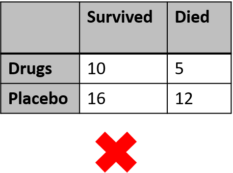
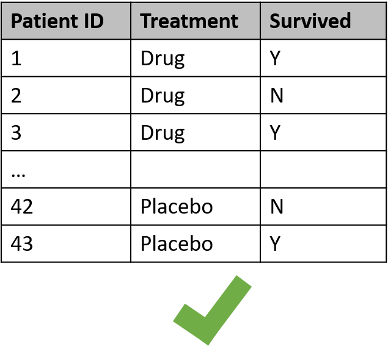

class: center, inverse    
# What is R?

--
.left[
- **free** software environment for statistical computing and graphics
]
--
.left[
- there are 18,732 packages in the CRAN repository
]
--
.left[
- can be used to clean, visualize, and present data
   + Tidyverse
]


---
class: center, inverse
# Reading in Data: Tidy Data
--
class: center, inverse
.left[
Requirements for tidy data
1. Each variable forms a column
2. Each observations forms a row
3. Each type of observational unit forms a table
]
--
.pull-left[

]
--
.pull-right[
]


---
class: center, inverse  
# Cleaning Data: [dplyr](https://dplyr.tidyverse.org/)
--
class: center
.left[
- R package that includes functions that allow you to easily manipulate data
 
- allows for use of **%>%** (pipe) to string together multiple actions

- Some Common "Verbs" 
 + `filter()`
  
 + `select()`
  
 + `mutate()`
  
 + `arrange()`
  
 + `group_by()`
  
 + `summarize()`
]


---
class: center, inverse  
# Cleaning Data: dplyr
.pull-left[
## `FILTER()`
.left[- Choose rows
 

]
]
.pull-right[
## `SELECT()`
.left[- Choose columns
 
 
]]


---
class: center, inverse  
# Cleaning Data: dplyr
.pull-left[
## `MUTATE()`
.left[- create a new column
 

]]
.pull-right[
## `ARRANGE()`
.left[- order rows
 
 
]]


---
class: center, inverse  
# Cleaning Data: dplyr
.pull-left[
## `GROUP_BY()`
.left[- chunk the data in groups
 


]
]
.pull-right[
## `SUMMARIZE()`
.left[- calculate some statistic over the group
 
 
]]
 
.center[ all of these verbs (+ more) can be strung together using %>%]


---
class: center, middle, inverse
# Let's Go to the HTML file


---
class: center, inverse
# Visualizing Data: [ggplot](https://ggplot2.tidyverse.org/)
.left[
- R does have it own base version that can be used for plotting

- ggplot allows more control and looks prettier

- map data values to visual elements
 
- In general:
  1. Specify what data you are plotting (`aes()`)
  2. Specify how the data should be plotted (aesthetics mapping)
     + lines? dots? shapes? color?
     + a specific type of plot (boxplot? violinplot?)
     
  3. Specify any other modifications
     + axis labels? title? legend?
]


---
class: center, middle, inverse
# Let's Go to the HTML file


---
class: center, inverse
# Visualizing Data: [plotly](https://plotly.com/ggplot2/)
.left[
- just one of many options
  + [highcharter](https://jkunst.com/highcharter/)
  + [ggiraph](https://www.r-bloggers.com/2018/04/how-to-plot-with-ggiraph/)

- plotly integrates with ggplot and html presentations
 
- plotly can also be used with other programming languages (Python)
]
---
class: center, middle, inverse
# Let's Go to the HTML file


---
class:center, middle,inverse
### Visualizing Data: plotly Example
.left[
```{r, echo = TRUE, error = FALSE, warning = FALSE, message = FALSE, fig.align = 'center', out.width = "100%", out.height = "50%"}
library(plotly)
load(here::here("Figures","Fig1i.rda"))
Fig1i
```
]


---
class: center, inverse  
## Presenting Data: Rmarkdown, Docs, Slides, and Others
--
.left[
- [markdown](https://www.markdownguide.org/) is a separate language that R can use to create [many things](https://rmarkdown.rstudio.com/lesson-9.html)]

.left[
+ Documents
  + html
  + word
  + pdf
 
+ Slides
    + [ioslides](https://bookdown.org/yihui/rmarkdown/ioslides-presentation.html)
    + [xaringan](https://bookdown.org/yihui/rmarkdown/xaringan.html) and [xaringan extra](https://pkg.garrickadenbuie.com/xaringanExtra/#/?id=xaringanextra)
        + used to make these slides!
        + [basic intro](https://apreshill.github.io/data-vis-labs-2018/slides/06-slides_xaringan.html#82)
    + [powerpoint](https://bookdown.org/yihui/rmarkdown/powerpoint-presentation.html)
 
+ [R shiny](https://shiny.rstudio.com/tutorial/)
    + [cool examples](https://shiny.rstudio.com/gallery/)
    
+ [Flexboards](https://pkgs.rstudio.com/flexdashboard/)
]

    
     
     